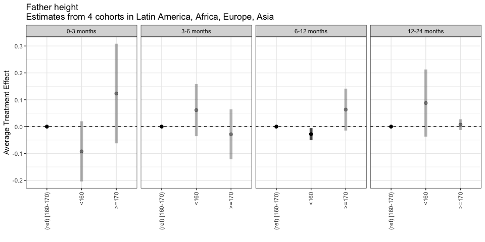
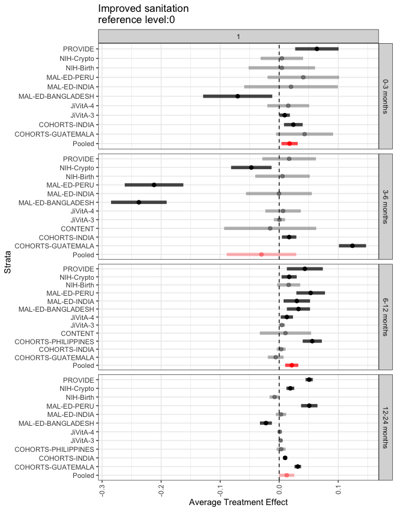
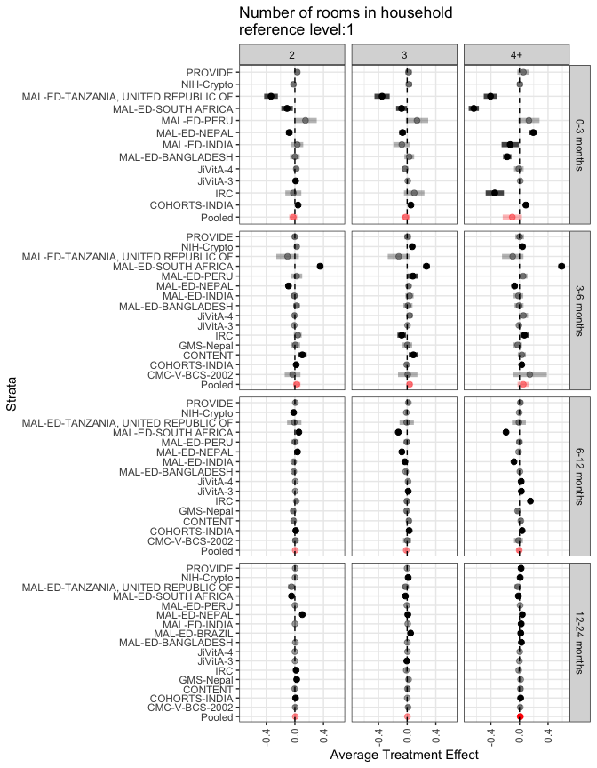
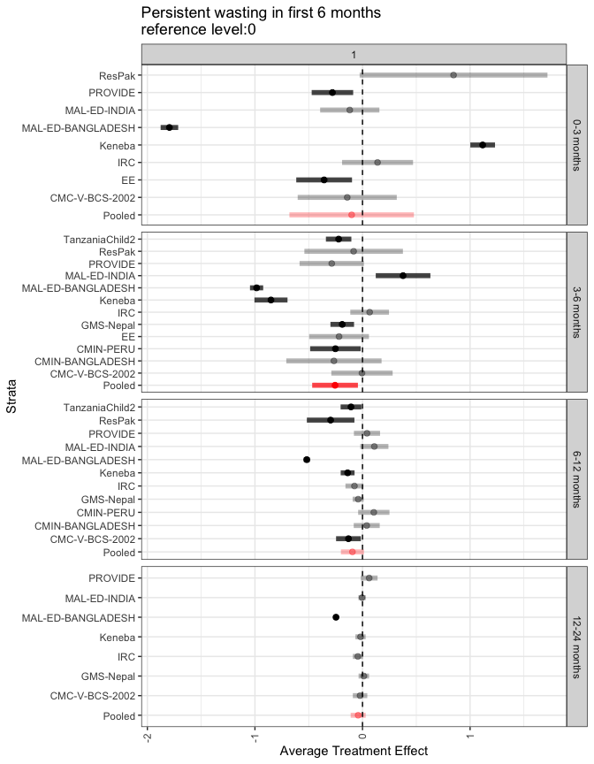
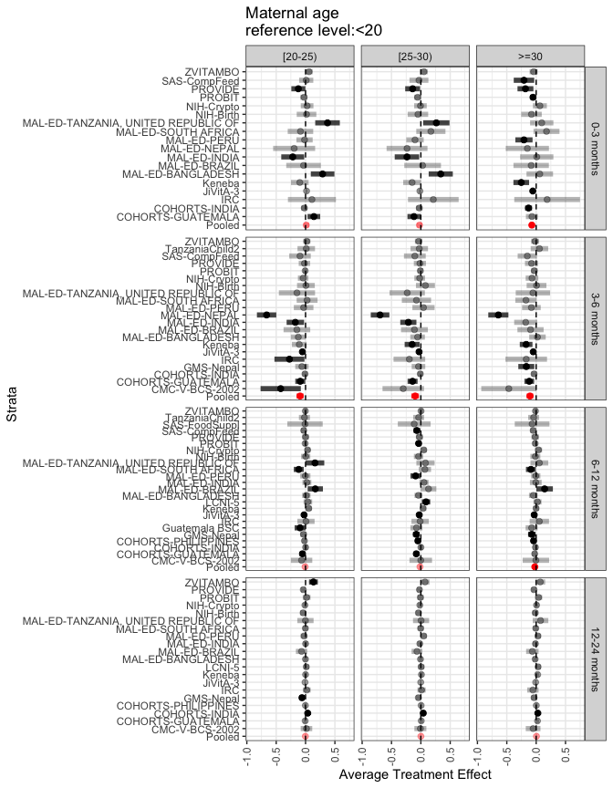

# Average treatment effect pooled across cohorts

  
## HAZ growth velocity  
  
### Child characteristics  
<!-- -->

  
<!-- -->

  
<!-- -->

  
<!-- -->

  
<!-- -->

  
<!-- -->

  
<!-- -->

  
<!-- -->

  
<!-- -->

  
<!-- -->

  
<!-- -->

  
<!-- -->

  
  
  
### Household characteristics  
<!-- -->

  
<!-- -->

  
<!-- -->

  
<!-- -->

  
<!-- -->

  
<!-- -->

  
<!-- -->

  
<!-- -->

  
<!-- -->

  
<!-- -->

  
  
  
### Maternal characteristics  
<!-- -->

  
<!-- -->

  
<!-- -->

  
<!-- -->

  
<!-- -->

  
<!-- -->

  
<!-- -->

  
  
  
### Paternal characteristics  
<!-- -->

  
<!-- -->

  
<!-- -->

  
  
  
  
## Length growth velocity  
  
### Child characteristics  
<!-- -->

  
<!-- -->

  
<!-- -->

  
<!-- -->

  
<!-- -->

  
<!-- -->

  
<!-- -->

  
<!-- -->

  
<!-- -->

  
<!-- -->

  
<!-- -->

  
<!-- -->

  
  
  
### Household characteristics  
<!-- -->

  
<!-- -->

  
<!-- -->

  
<!-- -->

  
<!-- -->

  
<!-- -->

  
<!-- -->

  
<!-- -->

  
<!-- -->

  
<!-- -->

  
  
  
### Maternal characteristics  
<!-- -->

  
<!-- -->

  
<!-- -->

  
<!-- -->

  
<!-- -->

  
<!-- -->

  
<!-- -->

  
  
  
### Paternal characteristics  
<!-- -->

  
<!-- -->

  
<!-- -->

  
  
  

# Appendix 1 - Average treatment effect stratified by cohort
  
## HAZ growth velocity  
  
### Child characteristics  
<!-- -->

  
<!-- -->

  
<!-- -->

  
<!-- -->

  
<!-- -->

  
<!-- -->

  
<!-- -->

  
<!-- -->

  
<!-- -->

  
<!-- -->

  
<!-- -->

  
<!-- -->

  
  
  
### Household characteristics  
<!-- -->

  
<!-- -->

  
<!-- -->

  
<!-- -->

  
<!-- -->

  
<!-- -->

  
<!-- -->

  
<!-- -->

  
<!-- -->

  
<!-- -->

  
  
  
### Maternal characteristics  
<!-- -->

  
<!-- -->

  
<!-- -->

  
<!-- -->

  
<!-- -->

  
<!-- -->

  
<!-- -->

  
  
  
### Paternal characteristics  
<!-- -->

  
<!-- -->

  
<!-- -->

  
  
  
  
## Length growth velocity  
  
### Child characteristics  
<!-- -->

  
<!-- -->

  
<!-- -->

  
<!-- -->

  
<!-- -->

  
<!-- -->

  
<!-- -->

  
<!-- -->

  
<!-- -->

  
<!-- -->

  
<!-- -->

  
<!-- -->

  
  
  
### Household characteristics  
<!-- -->

  
<!-- -->

  
<!-- -->

  
<!-- -->

  
<!-- -->

  
<!-- -->

  
<!-- -->

  
<!-- -->

  
<!-- -->

  
<!-- -->

  
  
  
### Maternal characteristics  
<!-- -->

  
<!-- -->

  
<!-- -->

  
<!-- -->

  
<!-- -->

  
<!-- -->

  
<!-- -->

  
  
  
### Paternal characteristics  
<!-- -->

  
<!-- -->

  
<!-- -->

  
  
  
