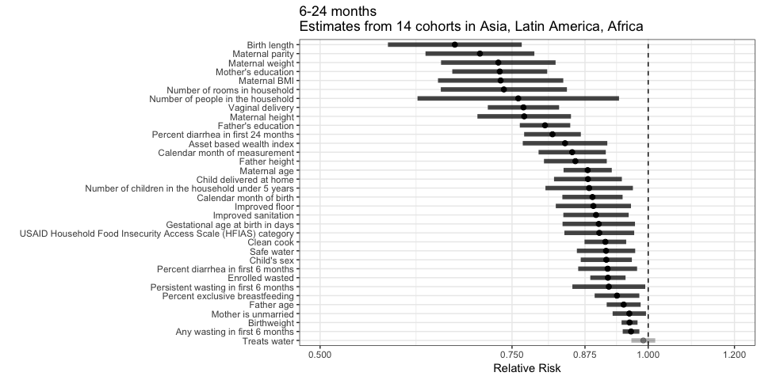
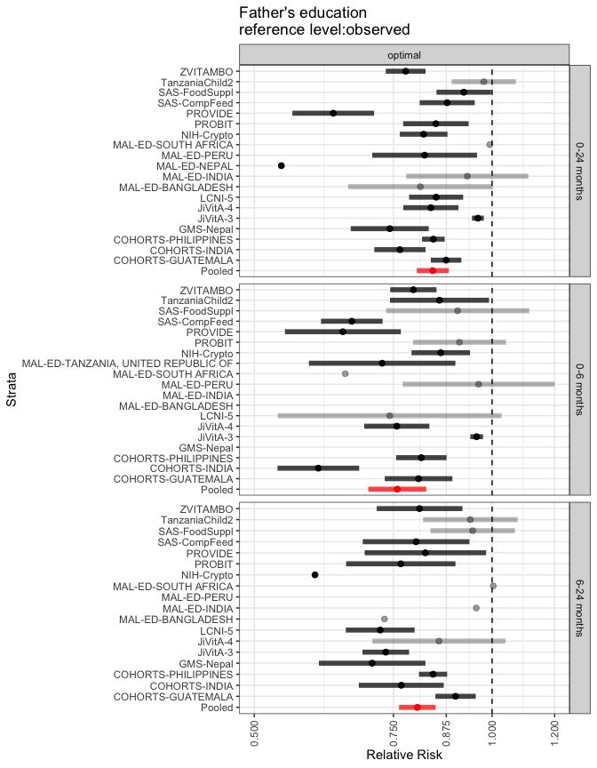

# Relative risk pooled across cohorts

  
## Cumulative incidence of stunting from birth to 24 months  
<!-- -->

  
<!-- -->

  
<!-- -->

  
  

# Appendix 1 - Relative risk stratified by cohort
  
## Cumulative incidence of stunting from birth to 24 months  
  
### Child characteristics  
<!-- -->

  
<!-- -->

  
<!-- -->

  
<!-- -->

  
<!-- -->

  
<!-- -->

  
<!-- -->

  
<!-- -->

  
<!-- -->

  
<!-- -->

  
<!-- -->

  
<!-- -->

  
<!-- -->

  
<!-- -->

  
  
  
### Household characteristics  
<!-- -->

  
<!-- -->

  
<!-- -->

  
<!-- -->

  
<!-- -->

  
<!-- -->

  
<!-- -->

  
<!-- -->

  
<!-- -->

  
<!-- -->

  
  
  
### Maternal characteristics  
<!-- -->

  
<!-- -->

  
<!-- -->

  
<!-- -->

  
<!-- -->

  
<!-- -->

  
<!-- -->

  
  
  
### Paternal characteristics  
<!-- -->

  
<!-- -->

  
<!-- -->

  
  
  
